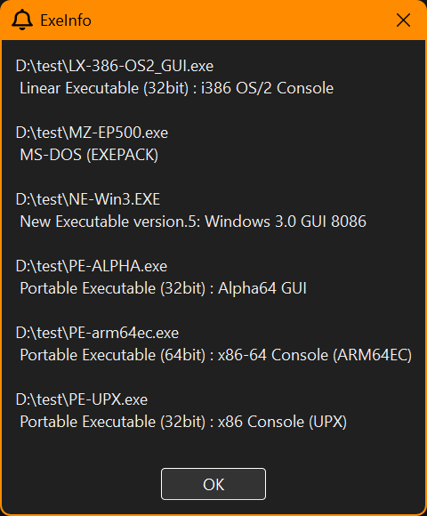

# ExeInfo

`Exeinfo` is a GUI application for Windows that analyzes PE (Portable Executable) files—such as .exe, .dll, and .sys—and displays which operating systems the files are designed to support.
It supports a wide range of formats, from legacy DOS-based executables to modern 64-bit Windows binaries.



## Features

Displays target OS and architecture information from PE files

Supports .exe, .dll, .sys, and other PE-based formats

Handles DOS stubs, NE, LE/LX, and PE/PE32+/PE64 headers

## Usage

> exeinfo.exe [input file] [input file] ...

## Build

Build Requirements: CMake and Visual Studio

```console
mkdir vs2022
cd vs2022
cmake ../ -G "Visual Studio 17 2022"
start ExeInfo.sln
```

## License

MIT

